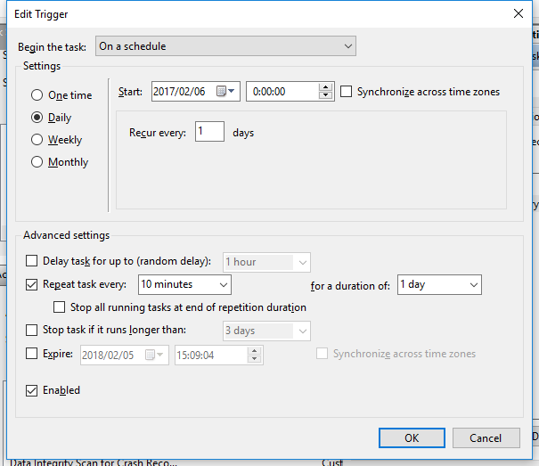

# goeye

goeye is a process checking tool.  
This is not a daemon, so should be used with automatic execution tool such as Cron, Windows Task Scheduler, and so on.

## Usage

Give some file paths you wanna check.

```
Usage: goeye FILE...
```

for example,

```
goeye "C:\Program Files (x86)\Dropbox\Client\Dropbox.exe"
```

## Example setting of Windows Task Scheduler

1. Get file paths of target processes
	1. [Windows] + [X] -> [Task Manager]
	1. Open context menu of the process and select [Open file location]
	1. Copy the path (Tips: Shift and Context key -> [Copy as path])
1. Open Computer Management window
	1. [Windows] + [X] -> [Computer Management]
1. Open Create Task window
	1. Select [Task Scheduler] in left pane
	1. Select [Create Task...] in right pane
1. General tab  
	
1. Triggers tab  
	
1. Actions tab  
	

## Installation

You can use `go get`.

```
go get -u github.com/zuiurs/goeye
```

# About ./script

- process_check_windows.bat
	- works the same as goeye
- process_check.vbs
	- to hide cmd window at batch runtime

## License

MIT
